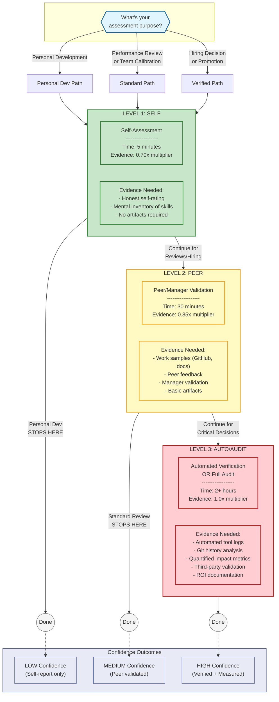

# AIQ Assessment Decision Flow

## How to Read

1. **Start at top** - Identify your assessment purpose
2. **Green (Level 1: Self)** - Quick self-assessment (0.70x), sufficient for personal development
3. **Yellow (Level 2: Peer)** - Peer/manager validation (0.85x), standard rigor for performance reviews
4. **Red (Level 3: Auto/Audit)** - Automated verification or full audit (1.0x), maximum rigor for high-stakes decisions

## Rendering

Works in: GitHub, VS Code (Mermaid extension), [Mermaid Live Editor](https://mermaid.live), Notion, Confluence
